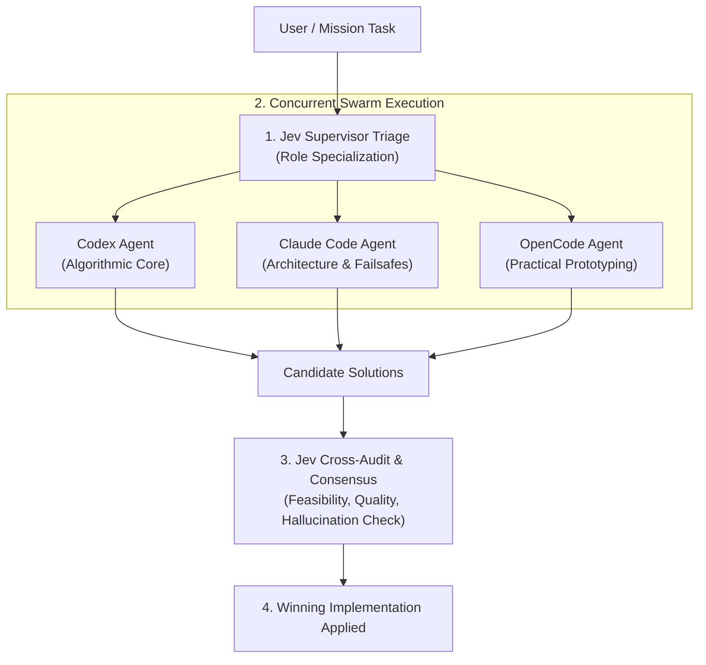

# 🛸 Drones Swarm Coordinator & Multi-Agent Supervisor

The **`drones-swarm`** skill orchestrates a heterogeneous multi-agent swarm composed of **OpenAI Codex**, **Claude Code**, and **OpenCode**, with **TypeSafe Jev (System One AI)** acting as the central intelligence and supervisory layer.

---

## 🏗️ Architecture & Orchestration Flow



---

## ⚡ Agent Role Specialization via Jev

1. **Codex Agent (`codex exec`)**:
   - Specialized in mathematical modeling, control theory (PID, LQR), state estimation, and rigorous unit testing.
2. **Claude Code Agent (`claude`)**:
   - Specialized in clean architecture, type contracts, boundary failsafes (e.g. Return-to-Home / low battery safety), and documentation.
3. **OpenCode Agent (`opencode run`)**:
   - Specialized in rapid prototyping, hardware I/O protocols (MAVLink, ROS2, serial telemetry), and modular utility functions.
4. **TypeSafe Jev Supervisor (`askJev`)**:
   - **System One decisions in ~250ms**:
     - Determines domain classification (`algorithm_and_control`, `navigation_and_pathfinding`, etc.).
     - Rates swarm consensus and mutual consistency (`swarmConsensusScore`).
     - Selects the best performing solution (`bestPerformingAgent`).
     - Flags drone flight safety compliance (`overallMissionFeasibility`).

---

## 💰 Cost Modes & Working Tiers (Adjustable)

By design, **the default mode is `economy`**, prioritizing zero or ultra-low token expenditure before escalating.

| Mode | Token Cost | Default Model | Typical Swarm Composition |
|---|---|---|---|
| **`economy`** *(Default)* | **$0 / Minimal** | `opencode/mimo-v2.5-free` (or Nemotron free) | OpenCode free tier or single lean agent |
| **`balanced`** | Low / Moderate | `opencode-go/qwen3.8-flash` / `gpt-4o-mini` | OpenCode Flash + Codex mini |
| **`premium`** | Full / Frontier | `opencode-go/qwen3.8-max` / `o3-mini` / `claude-3-7-sonnet` | Full multi-agent consensus (Codex + Claude + OpenCode) |

### Adjusting Modes:
1. **CLI Flag**: `--mode economy` / `--mode balanced` / `--mode premium`
2. **Configuration File**: Edit `.dronesrc` in project root (`{ "mode": "economy" }`)
3. **Environment Variable**: `export DRONES_MODE="balanced"`

---

## 🚀 Usage

### Run Swarm with Adjustable Cost Mode

```bash
# 1. Starts in economy mode (Free tier: mimo-v2.5-free)
node skills/drones-swarm/scripts/swarm-orchestrator.mjs "Write a PID attitude controller in Python"

# 2. Balanced mode (Fast, low-cost frontier models)
node skills/drones-swarm/scripts/swarm-orchestrator.mjs --mode balanced "Implement Kalman filter for drone sensors"

# 3. Premium mode (Full concurrent swarm: Codex, Claude, OpenCode Max)
node skills/drones-swarm/scripts/swarm-orchestrator.mjs --mode premium "Synthesize complete multi-copter collision avoidance system"
```

# Run with specific agent subset
node skills/drones-swarm/scripts/swarm-orchestrator.mjs --agents opencode,codex "Write an obstacle avoidance algorithm using simulated 2D LiDAR range data"

# Output structured JSON for automated pipelines
node skills/drones-swarm/scripts/swarm-orchestrator.mjs --json "Calculate drone optimal path using Dubins paths"
```

### Direct Shortcut (npm)

```bash
npm run swarm "Design a failsafe protocol for signal loss in PX4 autopilot"
```

---

## 📊 Sample Output

```text
=============================================================
       🛸 DRONES SWARM COORDINATOR & JEV SUPERVISOR
=============================================================
🎯 Misión:           Implement a quadcopter attitude Kalman filter
🌐 Dominio:          ALGORITHM_AND_CONTROL
🏆 Agente Ganador:   CODEX (Confianza: 96%)
📊 Consenso Swarm:   2.85 / 3
🛡️ Viabilidad Vuelo: APROBADO ✔ (98%)
-------------------------------------------------------------
⏱️ DESEMPEÑO DEL ENJAMBRE:
  ⭐ [GANADOR] codex     : ✔ Exitoso en 2340ms
     opencode  : ✔ Exitoso en 1890ms
     claude    : ✔ Exitoso en 3100ms
-------------------------------------------------------------
📄 SOLUCIÓN SELECCIONADA (CODEX):
[Robust attitude estimation code]
=============================================================
```
