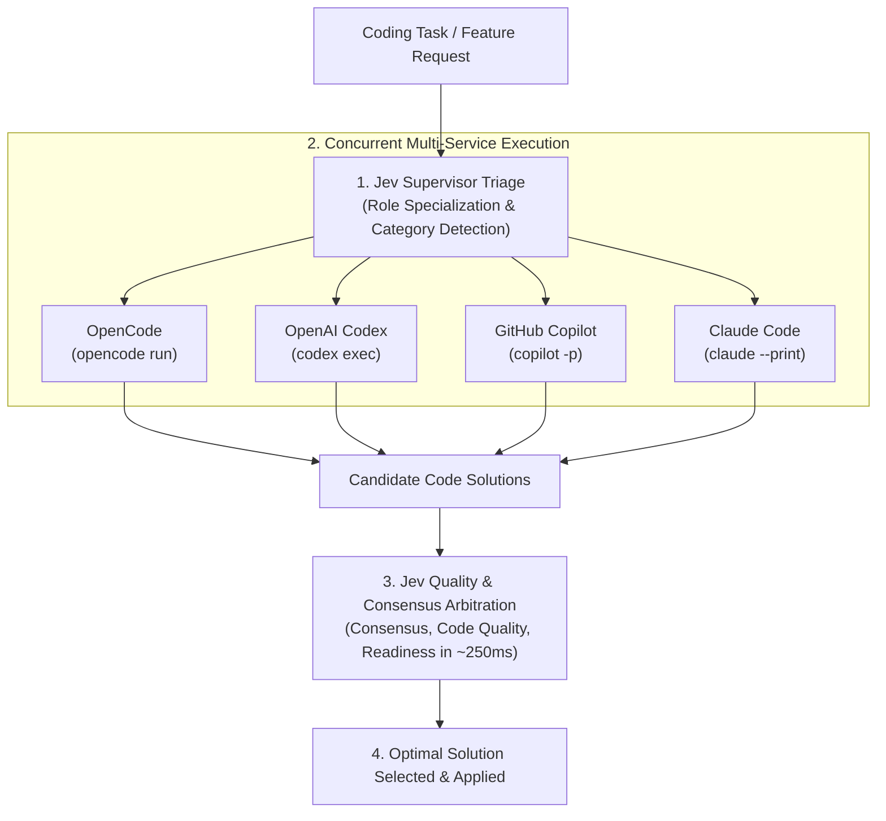

# 🛸 Drones: Multi-Service Swarm Coordinator & Jev Supervisor

The **`drones-swarm`** skill orchestrates multi-agent software engineering work across multiple external services—**OpenCode**, **OpenAI Codex**, **GitHub Copilot**, and **Claude Code**—using **TypeSafe Jev (System One AI)** as an ultra-fast supervisor and quality arbiter.

---

## 🏗️ Architecture & Service Coordination Flow



---

## ⚡ Service Role Specialization via Jev

1. **OpenCode (`opencode run`)**:
   - Ideal for rapid implementation generation, utility scripts, and zero-cost iteration using free community models.
2. **OpenAI Codex (`codex exec`)**:
   - Ideal for mathematical algorithms, data structures, and edge-case test suites.
3. **GitHub Copilot (`copilot -p`)**:
   - Ideal for idiomatic language patterns, standard library conventions, ecosystem tooling, and clean boilerplate.
4. **Claude Code (`claude --print`)**:
   - Ideal for architectural refactoring, strong typing, documentation, and defensive error boundaries.
5. **TypeSafe Jev (`askJev`)**:
   - Runs in **~250ms with just ~300 tokens** to specialize agent prompts, compute consensus scores, evaluate readability, and pick the winning code.

---

## 💰 Cost Modes (Adjustable)

By default, **Drones begins in `economy` mode** to prevent unnecessary token consumption:

| Mode | Cost | Default Model / Strategy | Active Services |
|---|---|---|---|
| **`economy`** *(Default)* | **$0 / Mínimo** | `opencode/mimo-v2.5-free` | OpenCode free tier or single lean pass |
| **`balanced`** | Bajo / Moderado | `opencode-go/qwen3.8-flash` | OpenCode Flash + GitHub Copilot |
| **`premium`** | Frontera | `opencode-go/qwen3.8-max` / `o3-mini` | OpenCode Max + Codex + Copilot + Claude Code |

### Adjusting Modes:
1. **Flag CLI**: `--mode economy` / `--mode balanced` / `--mode premium`
2. **Config File**: `.dronesrc` (`{ "mode": "economy" }`)
3. **Env Variable**: `export DRONES_MODE="balanced"`

---

## 🚀 Usage

### Multi-Service Swarm Execution
```bash
# 1. Starts in economy mode (Free OpenCode model: mimo-v2.5-free)
node skills/drones-swarm/scripts/swarm-orchestrator.mjs "Write a rate limiter middleware in TypeScript with Redis backing"

# 2. Balanced mode (OpenCode Flash + GitHub Copilot)
node skills/drones-swarm/scripts/swarm-orchestrator.mjs --mode balanced "Implement LRU cache with O(1) get and put"

# 3. Explicit services subset
node skills/drones-swarm/scripts/swarm-orchestrator.mjs --agents opencode,copilot,codex "Build a JSON schema validator"

# 4. JSON output for automated CI/CD agent workflows
node skills/drones-swarm/scripts/swarm-orchestrator.mjs --json "Parse JWT tokens safely without third-party deps"
```

### Direct Shortcut (npm)
```bash
npm run swarm "Implement WebSocket reconnect handler with exponential backoff"
```
