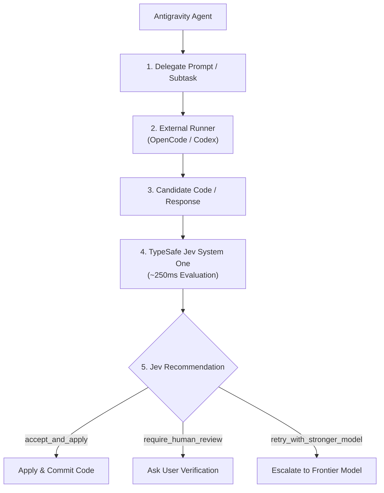

# 🛸 Multi-Model Runner & Jev Evaluator

The **`multi-model-runner`** skill integrates external LLM backends (OpenCode open/free models, DeepSeek, Qwen, Minimax, and OpenAI Codex) directly into **Antigravity**. Instead of trusting arbitrary LLM outputs or burning massive context tokens in iterative loops, this skill leverages **TypeSafe Jev (System One)** to evaluate the candidate output in ~250ms, ensuring quality, safety, and recommending next actions.

---

## 🏗️ Architecture & Flow



---

## ⚡ Supported Providers & Models

### 1. OpenCode (`opencode run`)
Zero configuration required for local access. Supports free community models as well as advanced models:
- **Free / Community Models**:
  - `opencode/mimo-v2.5-free` (Default fast model)
  - `opencode/nemotron-3.5-lightning-free`
  - `opencode/ling-3.0-flash-fin-free`
- **Advanced High-Capability Models**:
  - `opencode-go/qwen3.8-max` / `opencode-go/qwen3.8-flash`
  - `opencode-go/deepseek-v4-pro` / `deepseek-v4.1-flash`
  - `opencode-go/minimax-m3`
  - `opencode-go/glm-5.3`

### 2. OpenAI Codex CLI (`codex exec`)
- Native access via `codex exec "<task>"` for non-interactive coding executions.

### 3. Claude Code / Anthropic
- Can be invoked directly via CLI or API when Anthropic credentials (`ANTHROPIC_API_KEY`) are present in the environment.

---

## 🚀 Usage

### Basic Execution with Jev Evaluation
```bash
node skills/multi-model-runner/scripts/model-runner.mjs "Write a Python function to calculate drone waypoint distance using Haversine formula"
```

### Specifying a Model & Provider
```bash
# Using Qwen 3.8 Flash via OpenCode
node skills/multi-model-runner/scripts/model-runner.mjs -m opencode-go/qwen3.8-flash "Optimize trajectory algorithm"

# Using Codex CLI
node skills/multi-model-runner/scripts/model-runner.mjs --provider codex "Refactor drone state machine"
```

### Output Formats
- **Console / Human-Readable**: Displays execution time, Jev score, clean status, and recommended action.
- **JSON (`--json`)**: Emits structured machine-readable payload for programmatic pipeline consumption.
